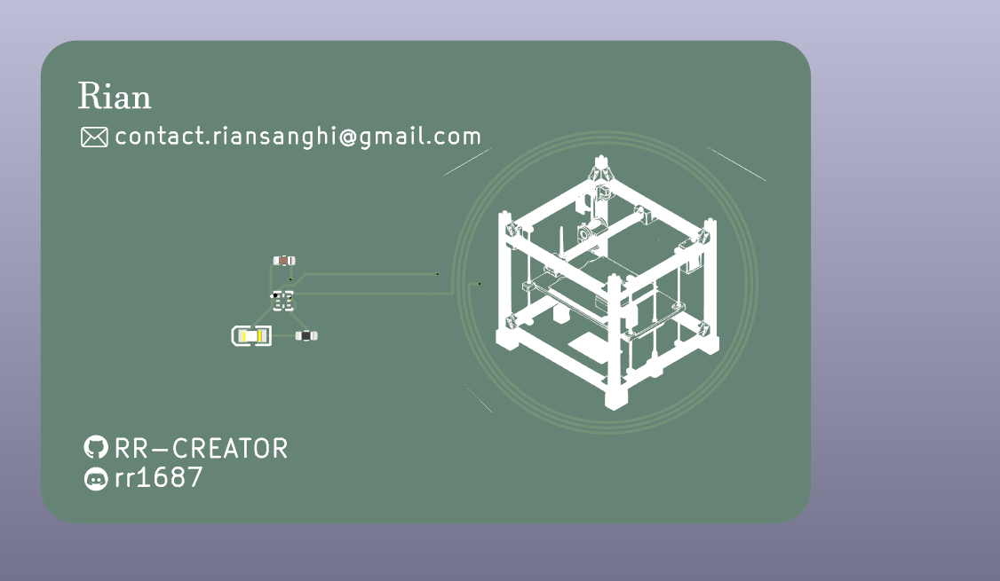
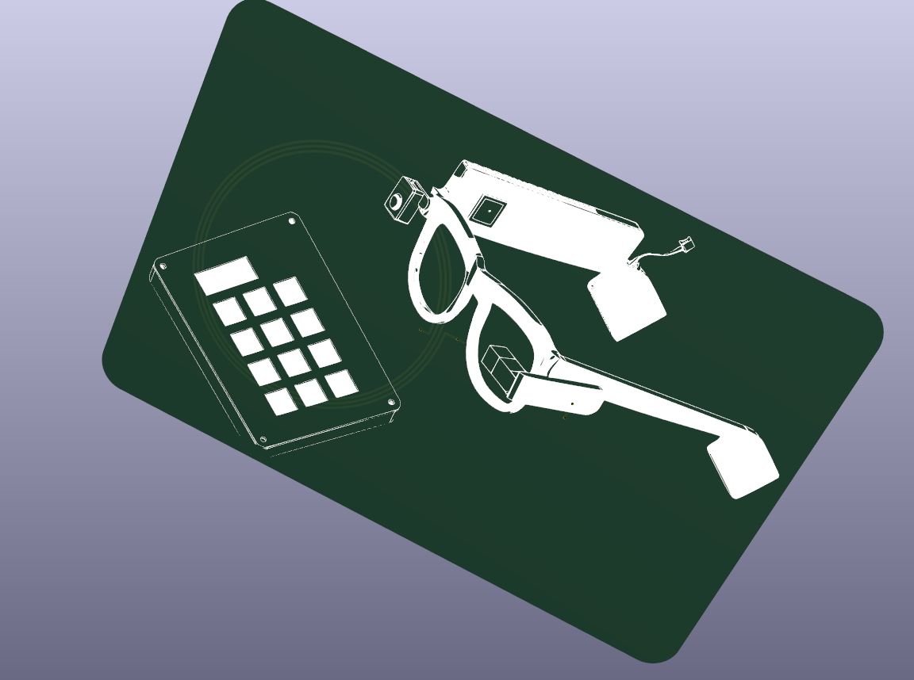
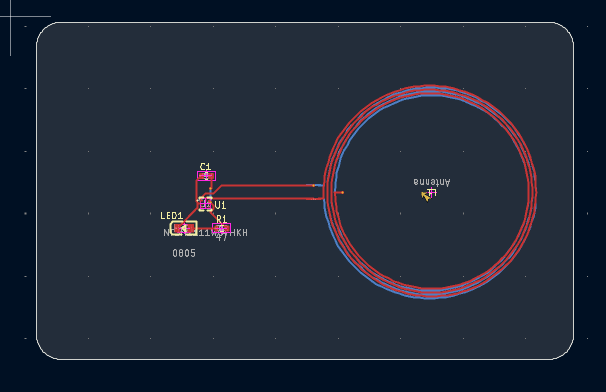
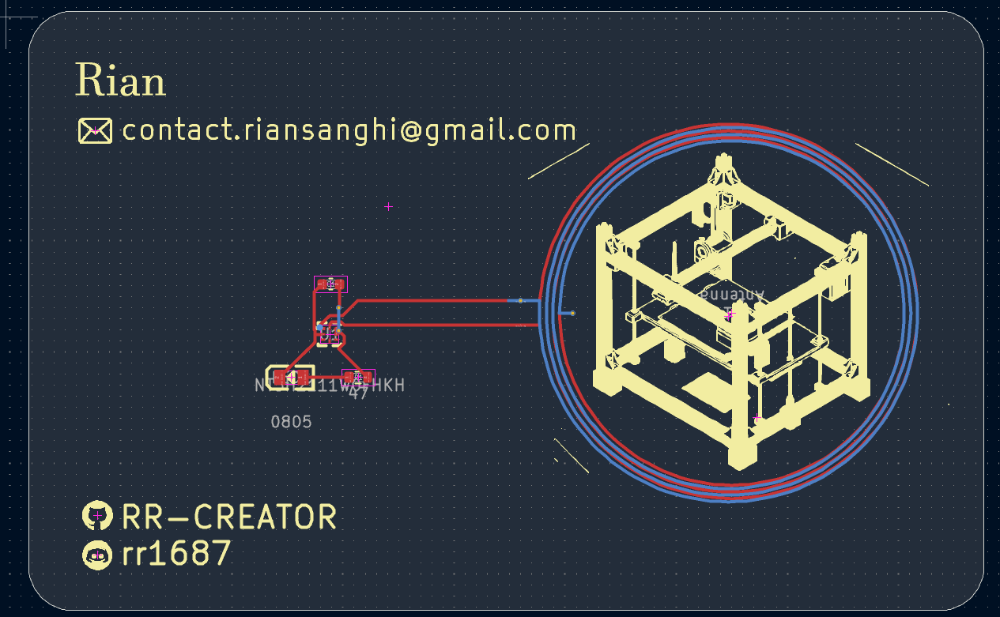
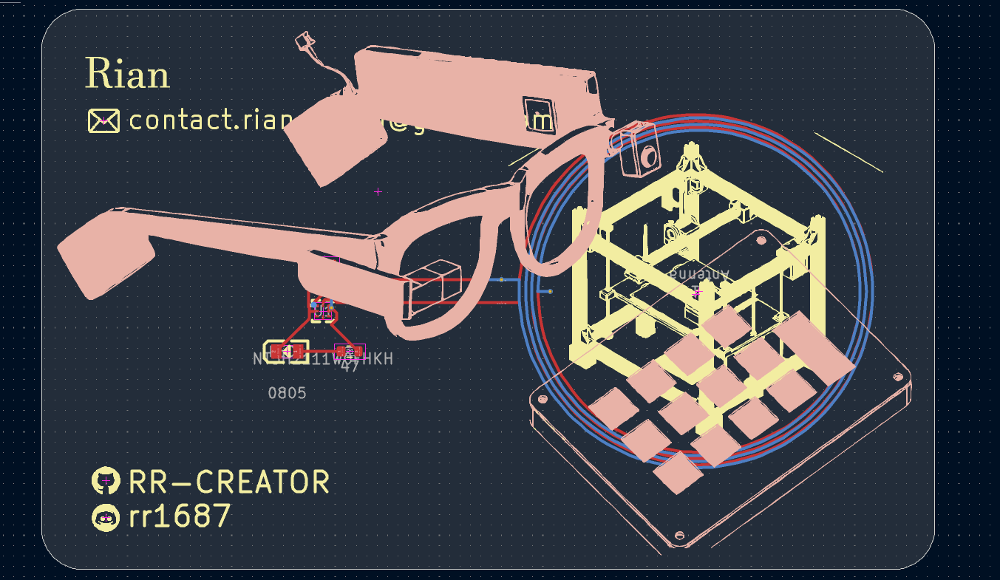
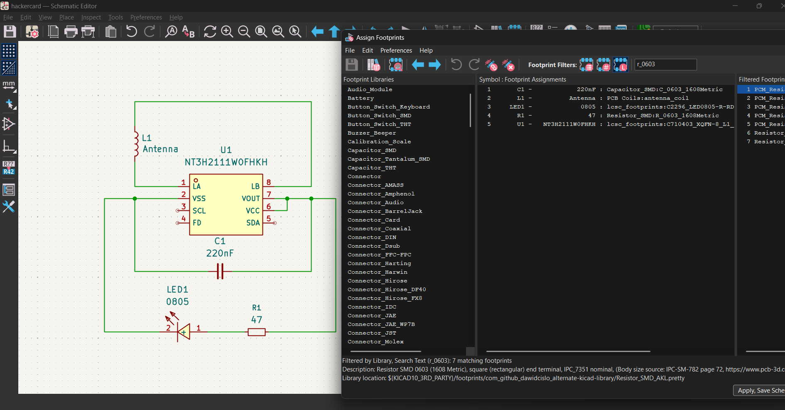
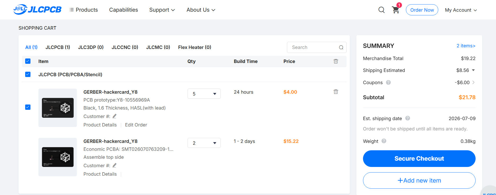

# RRcard

RRcard is my NFC business card / hacker card. It uses an NT3H2111 NFC chip with a PCB antenna, so tapping it with a phone can open my links without needing a QR code or typing anything manually.

I made this because normal business cards are kinda boring, and I wanted something that felt more like a PCB project than paper with text on it. I also wanted an excuse to KiCad, fight NFC antenna math, and see if I could get a tiny board fab-ready.

## Pictures

### Full 3D model

### PCB

### Schematic

## PCB design files

The KiCad files are in [`PCB design files`](PCB%20design%20files).

The JLCPCB production files are in [`PCB design files/jlcpcb/production_files`](PCB%20design%20files/jlcpcb/production_files).

## JLCPCB order cost

The final JLCPCB cart total came out to **$21.78 USD**.

## BOM

| Comment | Designator | Footprint | LCSC Part # | Quantity |
| --- | --- | --- | --- | ---: |
| 805 | LED1 | C2296_LED0805-R-RD | C84256 | 1 |
| 220nF | C1 | C_0603_1608Metric | C21120 | 1 |
| 47 | R1 | R_0603_1608Metric | C23182 | 1 |
| NT3H2111W0FHKH | U1 | C710403_XQFN-8_L1_6-W1_6-P0_50-BL_NT3H2111W0FHKH | C710403 | 1 |
